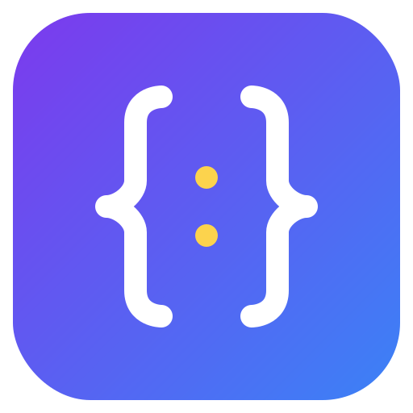

# JsonCMP

<p align="center">
  
</p>

[](https://github.com/skymansandy/jsonCMP/actions/workflows/deploy.yml) [](https://github.com/skymansandy/jsonCMP/actions/workflows/deploy.yml) [](https://central.sonatype.com/artifact/dev.skymansandy/json-cmp)

Kotlin Multiplatform Compose JSON viewer and editor component for Android, iOS, and JVM Desktop.

> **⚠️ Experimental:** This library is in an experimental state. APIs may change without notice between releases. Use in production at your own discretion.

## Features

- **JSON Viewer** — Read-only, syntax-highlighted, foldable JSON tree with virtualized rendering (virtually no size limit for valid JSON; invalid JSON truncated at 100 KB)
- **JSON Editor** — Editable JSON with real-time validation, formatting, and sorting (50 KB write limit)
- **Search** — Highlight matching text across the JSON document
- **Multiple Themes** — Dark, Light, Monokai, Dracula, Solarized Dark (+ custom themes)
- **KMP** — Android, iOS, and JVM Desktop support via Compose Multiplatform

## Installation

Add `mavenCentral()` to your repositories in `settings.gradle.kts`:

```kotlin
// settings.gradle.kts
dependencyResolutionManagement {
    repositories {
        mavenCentral()
        google()
    }
}
```

Then add the dependency:

```kotlin
// build.gradle.kts
dependencies {
    implementation("dev.skymansandy:json-cmp:1.0.0-beta1")
}
```

## Quick Start

### JSON Viewer

```kotlin
@OptIn(ExperimentalJsonCmpApi::class)
@Composable
fun MyViewer() {
    val state = rememberJsonViewerState(
        json = """{"name": "John", "age": 30}""",
    )

    JsonViewerCMP(
        modifier = Modifier.fillMaxSize(),
        state = state,
    )
}
```

### JSON Editor

```kotlin
@OptIn(ExperimentalJsonCmpApi::class)
@Composable
fun MyEditor() {
    val state = rememberJsonEditorState(
        initialJson = """{"name": "John", "age": 30}""",
    )

    JsonEditorCMP(
        modifier = Modifier.fillMaxSize(),
        state = state,
    )

    // Observe state reactively — no callbacks needed
    // state.json, state.parsedJson, state.error
}
```

## Themes

```kotlin
JsonViewerCMP(
    state = state,
    theme = JsonTheme.Monokai, // Dark, Light, Monokai, Dracula, SolarizedDark
)

// Or use a custom theme
JsonEditorCMP(
    state = editorState,
    theme = JsonTheme.Custom(myColors),
)
```

## API

### JsonViewerCMP

```kotlin
@Composable
fun JsonViewerCMP(
    modifier: Modifier = Modifier,
    state: JsonViewerState,
    searchQuery: String = "",
    theme: JsonTheme = JsonTheme.Dark,
)
```

### JsonEditorCMP

```kotlin
@Composable
fun JsonEditorCMP(
    modifier: Modifier = Modifier,
    state: JsonEditorState,
    searchQuery: String = "",
    theme: JsonTheme = JsonTheme.Dark,
)
```

### State

```kotlin
// Viewer — responds to changes in the json parameter
val viewerState = rememberJsonViewerState(json = "...")

// Editor — initialJson is used once to seed; editor owns its text state
val editorState = rememberJsonEditorState(initialJson = "...")

// Both expose observable properties:
// state.json       — current raw JSON text
// state.parsedJson — parsed JsonNode tree, or null if invalid
// state.error      — parse error, or null if valid
```
