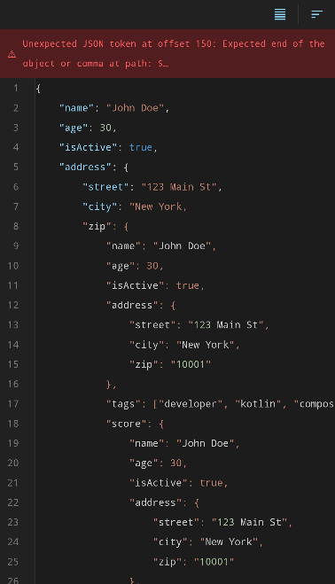

# JSON Editor

`JsonEditorCMP` provides inline text editing with real-time validation, formatting, and sorting.

<figure markdown="span">
  { width="350" }
  <figcaption>Editor with toolbar controls for formatting, sorting, and folding</figcaption>
</figure>

## Size Limit

The editor enforces a **50 KB write limit**. Content exceeding 50 KB is truncated — both for `initialJson` passed to `rememberJsonEditorState` and for user input during editing.

## Usage

```kotlin
@OptIn(ExperimentalJsonCmpApi::class)
@Composable
fun MyEditor() {
    val state = rememberJsonEditorState(initialJson = myJson)

    JsonEditorCMP(
        modifier = Modifier.fillMaxSize(),
        state = state,
    )
}
```

`initialJson` is used only once to seed the editor. The editor owns its own text state internally. To load entirely new content, wrap the composable in a `key(documentId)` block.

## Toolbar

The editor toolbar provides:

- **Format** — Toggle between pretty-print and compact (minified) output
- **Sort** — Sort object keys ascending or descending (recursive)
- **Collapse All / Expand All** — Fold or unfold all nodes

## Error Banner

When the JSON is invalid, an error banner appears below the toolbar showing:

- Error message
- Line and column position of the error

<figure markdown="span">
  { width="350" }
  <figcaption>Error banner showing parse error with position details</figcaption>
</figure>

## Real-time Validation

Observe changes reactively via Compose state properties on `JsonEditorState`:

```kotlin
val state = rememberJsonEditorState(initialJson = myJson)

// In composition or via snapshotFlow
state.json       // current raw JSON text
state.parsedJson // parsed JsonNode?, null if invalid
state.error      // JsonError?, null if valid
```

No callbacks needed — the state properties update automatically as the user edits.
