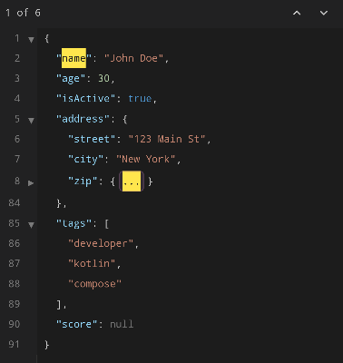
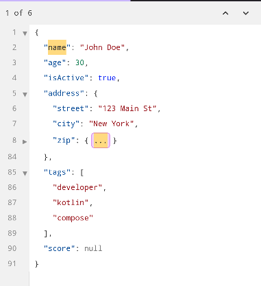
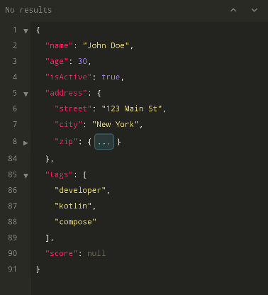
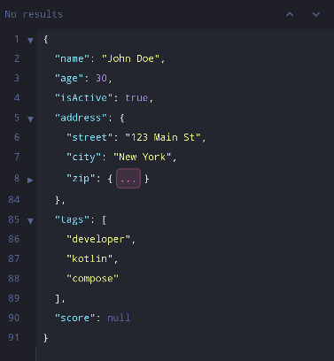
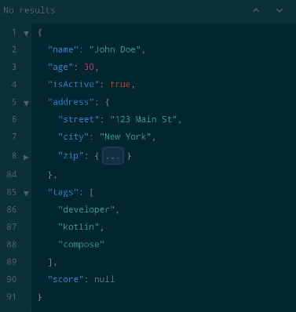

# Themes

JsonCMP ships with five built-in color themes and supports custom themes via `JsonTheme`.

## Built-in Themes

=== "Dark"

    { width="350" }

    `JsonTheme.Dark` — Dark background, blue keys, orange strings (VS Code Dark+)

=== "Light"

    { width="350" }

    `JsonTheme.Light` — White background, blue keys, red strings (VS Code Light+)

=== "Monokai"

    { width="350" }

    `JsonTheme.Monokai` — Dark green background, pink keys, yellow strings

=== "Dracula"

    { width="350" }

    `JsonTheme.Dracula` — Dark purple background, cyan keys, yellow strings

=== "Solarized Dark"

    { width="350" }

    `JsonTheme.SolarizedDark` — Dark blue-green background, blue keys, teal strings

## Usage

```kotlin
JsonViewerCMP(
    state = state,
    theme = JsonTheme.Dracula,
)

JsonEditorCMP(
    state = editorState,
    theme = JsonTheme.Monokai,
)
```

## Custom Themes

Create a custom theme by wrapping a `JsonCmpColors` instance in `JsonTheme.Custom`:

```kotlin
val myColors = JsonCmpColors(
    key = Color(0xFF9CDCFE),
    string = Color(0xFFCE9178),
    number = Color(0xFFB5CEA8),
    booleanColor = Color(0xFF569CD6),
    nullColor = Color(0xFF808080),
    punctuation = Color(0xFFD4D4D4),
    lineNumber = Color(0xFF858585),
    foldHint = Color(0xFF858585),
    background = Color(0xFF1E1E1E),
    gutterBackground = Color(0xFF252526),
    highlight = Color(0xFFFFEB3B),
    highlightFg = Color(0xFF1E1E1E),
    gutterBorder = Color(0xFF3C3C3C),
    foldEllipsis = Color(0xFFC586C0),
    errorBackground = Color(0xFF5C2020),
    errorForeground = Color(0xFFFF6B6B),
)

JsonEditorCMP(
    state = state,
    theme = JsonTheme.Custom(myColors),
)
```
