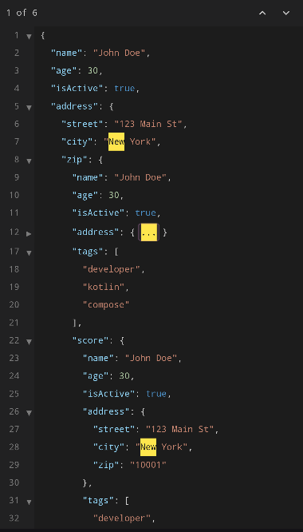

# JSON Viewer

`JsonViewerCMP` renders JSON as a read-only, syntax-highlighted tree with line numbers, code folding, and virtualized rendering.

<figure markdown="span">
  { width="350" }
  <figcaption>Viewer with syntax highlighting, line numbers, and code folding</figcaption>
</figure>

## Size Limits

- **Valid JSON** — Virtually no size limit. The viewer uses virtualized rendering to handle large documents efficiently.
- **Invalid JSON** — Truncated at 100 KB. A warning is shown indicating the original size and that the preview is truncated.

## Syntax Highlighting

Each JSON token type is rendered in a distinct color:

- **Keys** — object property names
- **Strings** — string values
- **Numbers** — numeric values
- **Booleans** — `true` / `false`
- **Null** — `null` values
- **Punctuation** — braces, brackets, colons, commas

## Code Folding

Objects and arrays can be collapsed by clicking the fold indicator in the gutter. Collapsed sections show an ellipsis with the element count.

<figure markdown="span">
  { width="350" }
  <figcaption>Collapsed "zip" object showing ellipsis with element count</figcaption>
</figure>

## Line Numbers

Line numbers are displayed in a gutter column with a subtle border separator.

## Search Highlighting

Pass a `searchQuery` to highlight matching text across the document:

```kotlin
JsonViewerCMP(
    state = state,
    searchQuery = "John",
    theme = JsonTheme.Dark,
)
```

Matches are highlighted with the `highlight` and `highlightFg` colors from the active theme.

<figure markdown="span">
  { width="350" }
  <figcaption>Search results highlighted with match counter and navigation</figcaption>
</figure>

## Nested Scrolling

`JsonViewerCMP` uses `LazyColumn` internally for virtualized rendering. If you place it inside a vertically scrollable parent (e.g. `Column` with `verticalScroll`, or another `LazyColumn`), you must give `JsonViewerCMP` a bounded height (e.g. `Modifier.height(400.dp)` or `Modifier.weight(1f)`) and handle nested scroll coordination on the client side using Compose's `nestedScroll` modifier.

```kotlin
// Example: viewer inside a scrollable Column
Column(Modifier.verticalScroll(rememberScrollState())) {
    Text("Header")

    // Give the viewer a fixed height so LazyColumn can measure
    JsonViewerCMP(
        modifier = Modifier.fillMaxWidth().height(500.dp),
        state = state,
    )

    Text("Footer")
}
```

## Reactive State

The viewer responds to changes in the `json` parameter passed to `rememberJsonViewerState` — new values trigger a re-parse and update the display:

```kotlin
var json by remember { mutableStateOf(initialJson) }
val state = rememberJsonViewerState(json = json)

// Updating `json` will automatically re-render the viewer
json = newJson
```
