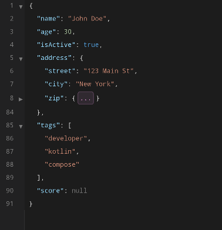
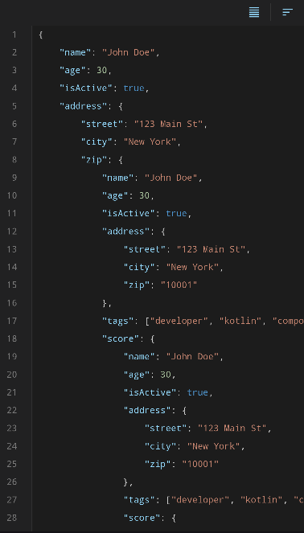

# JsonCMP

Kotlin Multiplatform Compose JSON viewer and editor component. Two separate composables — `JsonViewerCMP` for read-only rendering and `JsonEditorCMP` for editing — with syntax highlighting, code folding, real-time validation, formatting, sorting, and search highlighting. Ships for Android, iOS, and JVM Desktop.

!!! warning "Experimental"
    This library is in an experimental state. APIs may change without notice between releases. Use in production at your own discretion.

## Platform Support

| Platform | Supported |
|----------|:---------:|
| **Android** | ✅ |
| **iOS** | ✅ |
| **JVM Desktop** | ✅ |

## JSON Viewer

<figure markdown="span">
  { width="350" }
  <figcaption>Syntax-highlighted viewer with code folding and line numbers</figcaption>
</figure>

Drop-in read-only JSON renderer with virtualized rendering:

- Syntax highlighting (keys, strings, numbers, booleans, null, punctuation)
- Line numbers with gutter
- Code folding for objects and arrays
- Search text highlighting

```kotlin
@OptIn(ExperimentalJsonCmpApi::class)
@Composable
fun MyScreen() {
    val state = rememberJsonViewerState(json = myJson)

    JsonViewerCMP(
        modifier = Modifier.fillMaxSize(),
        state = state,
        searchQuery = "name",
    )
}
```

## JSON Editor

<figure markdown="span">
  { width="350" }
  <figcaption>Editable JSON with toolbar and real-time validation</figcaption>
</figure>

Full editing mode with real-time validation:

- Inline text editing with live parse feedback
- Error banner showing parse errors with line/column position
- Toolbar with format, sort, collapse/expand controls
- 50 KB write limit

```kotlin
@OptIn(ExperimentalJsonCmpApi::class)
@Composable
fun MyEditor() {
    val state = rememberJsonEditorState(initialJson = myJson)

    JsonEditorCMP(
        modifier = Modifier.fillMaxSize(),
        state = state,
    )

    // Observe state reactively
    // state.json, state.parsedJson, state.error
}
```

## Themes

Five built-in color themes inspired by popular code editors:

| Theme | Constant | Style |
|-------|----------|-------|
| VS Code Dark+ | `JsonTheme.Dark` | Dark background, blue keys, orange strings |
| VS Code Light+ | `JsonTheme.Light` | White background, blue keys, red strings |
| Monokai | `JsonTheme.Monokai` | Dark green background, pink keys, yellow strings |
| Dracula | `JsonTheme.Dracula` | Dark purple background, cyan keys, yellow strings |
| Solarized Dark | `JsonTheme.SolarizedDark` | Dark blue-green background, blue keys, teal strings |

Custom themes are supported via `JsonTheme.Custom(yourColors)`.
